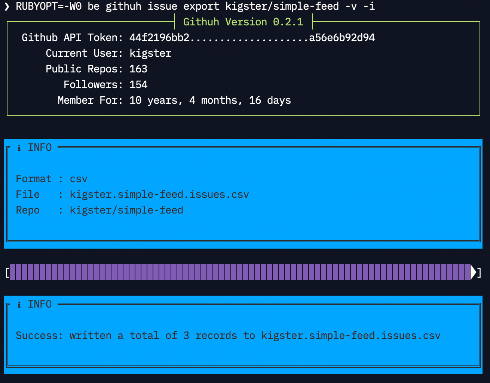

:doctype: book
:toc:
:toclevels: 4
:sectnums:
image:https://github.com/kigster/githuh/workflows/Ruby/badge.svg[Ruby,link=https://github.com/kigster/githuh/actions?query=workflow%3ARuby]

= Githuh -- GitHub API client

As in... *git? huh?*.

Github API client wrapper on top of Octokit, that provides extensible command pattern for wrapping Github functionality.

At the moment two features are implemented:

* Generating a list of org's (or personal) repositories and rending in either markdown or JSON
* Printing info of the logged in user.

== Using `githuh`

Add your Github Token to the global config:

[source,bash]
----
git config --global --set user.token <token>
----

After that:

[source,bash]
----
❯ be exe/githuh -h

Githuh CLI 0.2.1 — API client for Github.com.
© 2020 Konstantin Gredeskoul, All rights reserved.  MIT License.

Commands:
  githuh issue   [SUBCOMMAND]
  githuh repo    [SUBCOMMAND]
  githuh user    [SUBCOMMAND]
  githuh version                   # Print version, no subcommands
----

Githuh is invoked by using one of its commands and sub-commands.

=== `issue export`

Use this command to export all issues for a given repo into either a raw JSON format (using `--format=json`) or into a https://www.pivotaltracker.com/help/articles/csv_import_export[Pivotal Tracker-compatible CSV format] (the default output format).

[source,bash]
----
❯ be exe/githuh issue export -h

Githuh CLI 0.2.1 — API client for Github.com.
© 2020 Konstantin Gredeskoul, All rights reserved.  MIT License.

Command:
  githuh issue export

Usage:
  githuh issue export REPO

Description:
  Export Repo issues into a CSV or JSON format
  Default output file is <username>.<repo>.issues.<format>

Arguments:
  REPO                 # REQUIRED Name of the repo, eg "rails/rails"

Options:
  --api-token=VALUE    # Github API token; if not given, user.token is read from ~/.gitconfig
  --per-page=VALUE     # Pagination page size for Github API, default: 20
  --[no-]info          # Print UI elements, like a the progress bar, default: true
  --[no-]verbose       # Print additional debugging info, default: false
  --file=VALUE         # Output file, overrides <username>.<repo>.issues.<format>
  --format=VALUE       # Output format: (json/csv), default: "csv"
  --help, -h           # Print this help
----

==== Example

Eg, to export all issues of this repo into Pivotal Tracker compatibel CSV:

[source,bash]
----
# export into Pivotal Tracker CSV format
githuh issue export kigster/githuh -v -i --api-token=XXXX
----

You should see an output similar to the following:

=== `repo list`

==== Motivation

This functionality was born out of the need to generate a brief but comprehensive, well-formatted list of prior inventions for a typical employment contract.

NOTE: nothing in this library constitutes a legal advice. Use it at your own risk. For more information, please see xref:WARANTY.adoc[WARRANTY].

Please watch the following Ascii Screen cast to see this command in action:

image::https://asciinema.org/a/CW8NbYfu9RsifQJVU6tKRtRkU.svg[asciicast,link=https://asciinema.org/a/CW8NbYfu9RsifQJVU6tKRtRkU]

==== Usage

[source,bash]
----
❯ githuh repo list --help

Githuh CLI 0.1.2 — API client for Github.com.
© 2020 Konstantin Gredeskoul, All rights reserved.  MIT License.

Usage:
  githuh repo list

Description:
  List owned repositories and render the output in markdown or JSON
  Default output file is <username>.repositories.<format>

Options:
  --api-token=VALUE   # Github API token; if not given, user.token is read from ~/.gitconfig
  --per-page=VALUE    # Pagination page size for Github API, default: 20
  --[no-]info         # Print UI elements, like a the progress bar, default: true
  --[no-]verbose      # Print additional debugging info, default: false
  --file=VALUE        # Output file, overrides <username>.repositories.<format>
  --format=VALUE      # Output format: (markdown/json), default: "markdown"
  --forks=VALUE       # Include or exclude forks: (exclude/include/only), default: "exclude"
  --[no-]private      # If specified, returns only private repos for true, public for false
  --help, -h          # Print this help
----

==== Example

For instance, to generate a markdown list of all of your *public* repos that are also *not forks*, run the following:

[source,bash]
----
$ githuh repo list --format=markdown --no-private --forks=exclude --file=repos.md
----

=== `user info`

This command prints the info about currently authenticated user.

[source,bash]
----
❯ githuh user info
{
                  :login => "kigster",
                    :url => "https://api.github.com/users/kigster",
               :html_url => "https://github.com/kigster",
               ..............
----

== Contributing

Please submit a pull request at https://github.com/kigster/githuh/pulls

== License

&copy; 2020 Konstantin Gredeskoul, link:LICENSE[MIT License]
